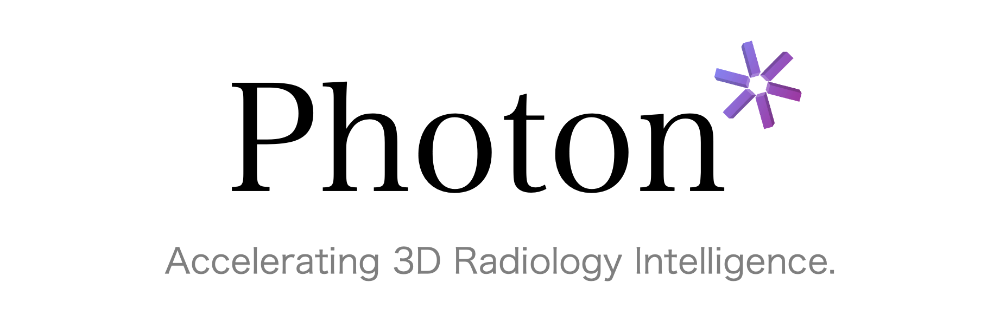

<p align=center></p>

<h1 align="center">
Speedup Volume Understanding with Efficient Multimodal Large Language Models</h1>

<div align="center">


<a href='https://arxiv.org/pdf/2603.25155'></a>
<a href='https://huggingface.co/Alibaba-DAMO-Academy/Photon-S1'></a>
<a href='https://huggingface.co/Alibaba-DAMO-Academy/Photon-S2'></a>
<a href='https://github.com/alibaba-damo-academy/Photon'></a>

</div>

## 👓 Overview

Multimodal large language models are promising for clinical visual question answering tasks, but scaling to 3D imaging is hindered by high computational costs. Prior methods often rely on 2D slices or fixed-length token compression, disrupting volumetric continuity and obscuring subtle findings. 
We present Photon, a framework that represents 3D medical volumes with token sequences of variable length. 
Photon introduces instruction-conditioned token scheduling and surrogate gradient propagation to adaptively reduce tokens during both training and inference, which lowers computational cost while mitigating the attention dilution caused by redundant tokens. It incorporates a custom backpropagation rule with gradient restoration to enable differentiable optimization despite discrete token drop. 
To stabilize token compression and ensure reliable use of visual evidence, Photon further applies regularization objectives that mitigate language-only bias and improve reliability.
Experiments on diverse medical visual question answering tasks show that Photon achieves state-of-the-art accuracy while reducing resource usage and accelerating both training and inference.

## ⚙️ Getting Started

### Install Requirements

```bash
git clone https://github.com/alibaba-damo-academy/Photon.git
cd Photon
uv pip install simpleitk==2.5.0, monai==1.4.0
uv pip install torch==2.7.0 torchvision==0.22.0 torchaudio==2.7.0 --index-url https://download.pytorch.org/whl/cu126
uv pip install -e . --torch-backend=auto
uv pip install flash-attn==2.8.0.post2, flashinfer-python==0.2.6.post1, xformers==0.0.30, numpy==1.26.4
```

### Inference
Photon S2 is fine-tuned from Photon S1 using task-specific datasets. For tasks not covered by the provided weights, we recommend using Photon S1 for inference. Before inference, please preprocess the data according to the data preparation section.
```bash
# inference photon s1
bash test_photon_s1.sh
# inference photon s2
bash test_photon_s2.sh
```

### Train
Before initiating Phase-1 training, overwrite the default configurations in the Qwen2.5 VL 3B pre-trained directory using the JSON files provided in configs. Subsequently, the weights generated from Phase-1 serve as the initialization for Phase-2 training.

If you use our pre-trained phase-1 weights, no modifications are needed.


```bash
# train photon s1
bash train_photon_s1.sh
# train photon s2
bash train_photon_s2.sh
```

If you want to fine-tune the phase-1 aligned model weights on your downstream task without performing token pruning, please skip phase 2 and use phase-1c:

```bash
bash train_photon_s1c.sh
```

The model trained with train_photon_s1c.sh can be inferred using the test_photon_s1.sh script.


## 📚 Data Preparation
We preprocess the CT volumes by reorienting them to the RAI coordinate system and resampling them to an isotropic voxel spacing of (1, 1, 1) mm. Each volume is then center-cropped or padded to dimensions of (364, 364, 364), and the Hounsfield unit (HU) values are clipped to the range [-1000, 1000].

### Data Sample
Our data format follows the specification compatible with ms-swift, and we recommend using JSON or JSONL format for data construction. Here is an example:

```bash
[
  {
    "messages": [
      {
        "role": "user",
        "content": "<video> Your instruct here."
      },
      {
        "role": "assistant",
        "content": "The response here."
      }
    ],
    "videos": [
      "XXX/XXX.nii.gz"
    ],
  },
]
```

## 🧱 Results

To facilitate direct comparison and mitigate discrepancies arising from variations in hardware, drivers, or package dependencies, we provide the inference results of our method on 3D-RAD and DeepTumorVQA. These results are available for [download](https://huggingface.co/Alibaba-DAMO-Academy/Photon-S2/resolve/main/results.zip?download=true) on the corresponding task and phase pages of our Hugging Face repository.

## 📎 Citation

If you find the code helpful in your research or work, please cite the following paper(s).

```
@inproceedings{fang2026photon,
  title={Photon: Speedup volume understanding with efficient multimodal large language models},
  author={Fang, Chengyu and Guo, Heng and Jiang, Zheng and He, Chunming and Li, Xiu and Xu, Minfeng},
  booktitle={The Fourteenth International Conference on Learning Representations},
  year={2026}
}
```

## ⭐ Acknowledgement

We build our framework based on ms-swift. For model training, we utilize a comprehensive dataset collection comprising CT-RATE, 3D-RAD, DeepTumorVQA, and AbdomenAtlas-3.0-Report. We sincerely thank all researchers and open-source contributors advancing the field of medical multimodal understanding.